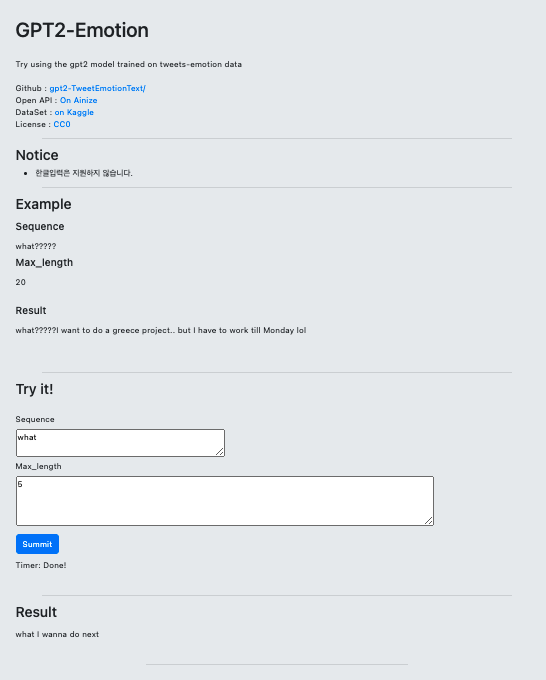

# GPT2-TweetEmotion_TextGenerator 모델 사용하기
#### 버튼을 누르면 실행해 볼 수 있습니다.

## Introduction
사용한 [허깅페이스 모델](https://huggingface.co/seokho/gpt2-emotion)

## How to use
* 간단한 샘플
* Sequence는 입력할 문자열입니다.
* Max_length는 출력할 최대 글자 수입니다.

## What is Ainize
Ainize는 커먼컴퓨터(Comon Computer)에서 재공하는 서비스로 Dockerfile과 github 주소만으로 무료로 서비스를 배포할 수 있습니다. 일일히 clone해오지 않아도 만들어진 샘플 및 모델들을 시연해 볼 수 있습니다.

## Reference
